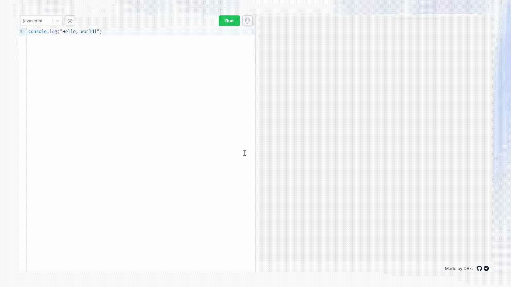

# CodeZone Frontend

Frontend for CodeZone online compiler

CodeZone - online compiler which executes user's code (for now without any inputs) in docker containers.

CodeZone can be tested [here](https://codezone.wdrxxx.online/) and backend repo can be found [here](https://github.com/wDRxxx/CodeZone-backend)

## Mini demo:

## How to run

1. run [backend](https://github.com/wDRxxx/CodeZone-backend#how-to-run) locally
2. create and configure `.env.local` based on `.env`
3. `npm run dev`
